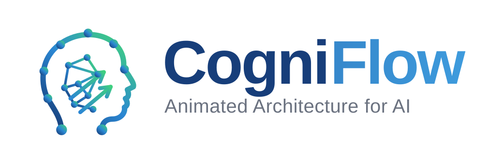

<p align="center">
  
</p>

# CogniFlow

**Animated Architecture for AI.** Free, open-source, browser-only studio for animated software architecture diagrams.
Design components on an infinite canvas, watch real data flow move between them, and export
animated GIFs, videos and slide decks — with an open-weight model that ships with the site.

Live: **https://cogniflow.prashobhpaul.com** (GitHub Pages)
License: **MIT** (models: Apache-2.0, see below)

No backend, no accounts, no telemetry. Everything — the canvas, the compilers, the renderers and
the AI model — runs in your browser. Hosted on GitHub Pages straight from this repository.

## What you get

| Feature                        | How                                                                                  |
| ------------------------------ | ------------------------------------------------------------------------------------ |
| Describe → diagram             | Rule-based compiler (instant) or an open-weight LLM in the browser                   |
| Image + instructions → diagram | SmolVLM-500M-Instruct in the browser (or your own endpoint)                          |
| draw.io import / export        | Deterministic mxGraph parser and serialiser                                          |
| Mermaid import / export        | Deterministic flowchart parser (subgraphs, fan-out, edge styles) and serialiser      |
| Autosave & crash recovery      | Debounced browser drafts; a refresh or crash never loses in-progress edits           |
| Share links                    | Whole diagram compressed into the URL — opens animated and editable, no backend      |
| MCP server                     | `bun run mcp/server.ts` — Claude / any LLM compiles + renders diagrams token-cheaply |
| Animated GIF · animated SVG    | Offline frame painter + `gifenc`, seamless loop-locked timing                        |
| MP4 (H.264) · WebM (VP9)       | WebCodecs + `mp4-muxer` / `webm-muxer`, MediaRecorder fallback                       |
| PPTX storyboard                | `pptxgenjs`: animated GIF cover + one narrated slide per flow                        |
| PNG · JPEG · SVG · AIR JSON    | One scene model that mirrors the canvas, so files match the page                     |
| Intent prompts                 | "agents for a full AIDLC lifecycle" → the closest reference pattern                  |
| 3D icon set                    | 120+ volumetric medallions, brand marks included, drawn once for canvas and exports  |

### Brand assets

The logo lives in `public/brand/`: `cogniflow-mark.svg` is the source of truth, and `bun run brand`
(`scripts/build-brand.mjs`) regenerates the favicons, Apple touch icon, light/dark lockups and the
social card from it. Edit the mark, run the script, commit the outputs.

### Symbol library

Every component is drawn as a 3D silhouette (`src/lib/studio/render/icons3d.ts`) that says what the
thing does, with its own processing animation (`src/lib/studio/render/motion.ts`) and a status
micro-badge. Glyphs are lucide icons or brand marks from the CC0
[simple-icons](https://simpleicons.org) set (`src/lib/studio/render/brands.ts`); brands the set does
not carry get a monogram. Logos remain trademarks of their owners and are used only to denote the
product in a diagram. The whole set, with live motion samples, is on the Open source page.

| Component                                   | Silhouette                            | Motion while active                       |
| ------------------------------------------- | ------------------------------------- | ----------------------------------------- |
| Hosted models (OpenAI, Claude, Gemini, …)   | Neural crystal                        | Perimeter pulse                           |
| Open / custom LLMs (Llama, Mistral, SLM, …) | Multi-layer neural lattice            | Layer nodes light up in sequence          |
| Agents, evaluators, rerankers               | Neural cube                           | Thinking ring spins                       |
| Embedding model                             | Funnel compressing into a dense array | Scan line                                 |
| Vector stores (Pinecone, Chroma, FAISS, …)  | 3D point cloud                        | Radar sweep                               |
| Relational / warehouse stores               | Stacked cylinders                     | Vertical pulse                            |
| Orchestrator, router, planner, workflow     | Dispatch hub with sub-nodes           | Core spins                                |
| LangGraph, LangChain, CrewAI, …             | Cyclic state ring                     | Ring spins until the loop terminates      |
| Queues (SQS, RabbitMQ, Kafka)               | Partitioned conveyor belt             | Belt dashes march, FIFO                   |
| Pub/Sub, load balancer, webhook             | Single entry fanning out              | Concentric ripples                        |
| API / LLM gateways, MCP, protocols          | Portal                                | Scanning laser                            |
| Guardrails, rate limiter, AI gateway        | Dual-pillar checkpoint gate           | Scanning laser                            |
| Observability (LangSmith, Langfuse, OTel…)  | Radar dish with range rings           | Radar sweep                               |
| Alerts, CloudWatch                          | Heartbeat monitor                     | Double-beat pulse                         |
| Documents, audio, video, users              | Sheet, waveform, film reel, avatar    | Static; the connector carries the payload |
| Cloud platforms                             | Platform disc                         | Dashed boundary sweep                     |

Status badges on every icon: **idle** (grey dot), **executing** (spinning ring), **success** (green
check), **fallback / retry** (amber), **error** (red). By default the badge is derived from the
connectors that touch the component (error and retry flows win, any active flow means executing);
set it explicitly per component in the inspector. Connector colours follow the semantic type: blue
for raw data and files, purple for embeddings, teal for retrieval, green for responses, red for
errors, amber for events, magenta for streams.

## Run it locally

```sh
git clone https://github.com/PrashobhPaul/CogniFlow
cd CogniFlow
bun install          # or: npm install
bun run dev          # http://127.0.0.1:8080
```

The rule-based compiler and every export work immediately. The in-browser AI engine downloads
its weights from the Hugging Face Hub on first use (and caches them) unless you vendor them:

```sh
bun run vendor-model         # downloads + chunks the models into public/models (~630 MB)
```

## Deploy your own copy on GitHub Pages

1. Fork this repository.
2. In **Settings → Pages → Build and deployment**, set _Source_ to **GitHub Actions**. This is a
   one-time manual step: GitHub does not let the workflow's own token create the Pages site, so the
   first run fails at `configure-pages` until it is done — re-run the workflow afterwards.
3. Push to `main` (or re-run the workflow from the Actions tab). `.github/workflows/deploy.yml` installs dependencies, **vendors the open-weight
   models at build time**, builds the static site with `BASE_PATH=/<repo-name>/`, and deploys `dist/`.

That is the whole hosting story: GitHub Actions builds, GitHub Pages serves, the browser does the rest.

### Putting the model in git instead

The deploy job vendors weights at build time so the repository stays small. If you want the weights
committed (for example to pin them or to host on a static server without Actions), run
`bun run vendor-model` locally and commit `public/models/`. Files are split into 45 MB parts, so
they stay under GitHub's 100 MB per-file limit; `manifest.json` tells the loader how to reassemble them.
GitHub Pages sites are limited to 1 GB, which fits both default models comfortably.

## Editing

The studio covers the draw.io-class editing basics: multi-select (Shift-drag or
Cmd/Ctrl-click), copy/paste/cut/duplicate/select-all shortcuts, Delete/Backspace,
right-click context menus (insert any component at the cursor, duplicate, delete,
auto-layout), double-click inline rename, drag an edge end to reconnect it, and
per-connector path styles (step / bezier / straight) that render identically in
every export. Unsaved work is autosaved to a browser draft (~1 s debounce, flushed
on tab close); reopening the studio restores it with a Discard option, and the
Projects page badges projects that carry unsaved drafts.

## Using CogniFlow from Claude or any LLM (MCP)

`mcp/server.ts` is a stdio [MCP](https://modelcontextprotocol.io) server that gives
any MCP client — Claude Desktop, Claude Code, agent frameworks — the whole compile
and render pipeline without a browser, so a model can hand off diagram drawing for
the cost of a ~50-token description instead of generating SVG token by token:

- `cogniflow_compile_architecture` — description or Mermaid → validated graph,
  narrated flow list, and a `share_url` that opens the animated, editable diagram
- `cogniflow_render_graph` — an edited graph → mermaid / draw.io / SVG / animated SVG
- `cogniflow_list_patterns` / `cogniflow_get_pattern` — reference architectures
- `cogniflow_list_components` — the classification vocabulary

**Local (stdio) — Claude Code / Claude Desktop.** Runs on your machine, zero hosting:

```sh
cd mcp && bun install                                   # once
claude mcp add cogniflow -- bun run <repo>/mcp/server.ts   # Claude Code
# Claude Desktop: add to claude_desktop_config.json (see mcp/claude-config.example.json):
{ "mcpServers": { "cogniflow": { "command": "bun", "args": ["run", "<repo>/mcp/server.ts"] } } }
```

**Remote (streamable HTTP) — claude.ai / Claude mobile custom connector.**
claude.ai connectors need a public HTTPS URL, so run `mcp/http-server.ts` on any
host that runs bun and terminates TLS (small VM behind Caddy/nginx, Render, Fly.io,
Railway — GitHub Pages can't host it, it's static-only):

```sh
COGNIFLOW_MCP_TOKEN=<secret> bun run mcp/http-server.ts   # listens on :8788 at POST /mcp
# then: claude.ai → Settings → Connectors → Add custom connector → https://<your-host>/mcp
```

It's stateless (fresh server per request, no session affinity) so it scales
horizontally; `COGNIFLOW_MCP_TOKEN` enables bearer auth, `COGNIFLOW_SITE_URL`
overrides the share-link origin, and `GET /healthz` is a probe endpoint.

Share links encode the whole graph (deflate + base64url) in the URL — nothing is
uploaded anywhere; `src/lib/studio/headless.ts` exposes the same compile/export
API for scripts and tests (`bun test tests/`). `scripts/bench-headless.ts` and
`scripts/bench-mcp.ts` reproduce the pipeline and server load benchmarks.

## The AI engines

| Engine                   | Where it runs                                                                                                | Configure                                                  |
| ------------------------ | ------------------------------------------------------------------------------------------------------------ | ---------------------------------------------------------- |
| **In-browser** (default) | Transformers.js + ONNX Runtime Web in a Web Worker; WebGPU when available, WASM otherwise                    | Settings → AI engine → model ids / compute                 |
| **Your endpoint**        | Any OpenAI-compatible `/v1/chat/completions` (Ollama, vLLM, LM Studio, llama.cpp, HF router, Groq, Together) | Settings → base URL, key, models; the host must allow CORS |

Default models (both Apache-2.0, by Hugging Face TB):

- Text: `HuggingFaceTB/SmolLM2-360M-Instruct` (ONNX q4f16, ~270 MB)
- Vision: `HuggingFaceTB/SmolVLM-500M-Instruct` (ONNX q4f16, ~360 MB)

Change them in `scripts/vendor-model.mjs` (what gets vendored) and in Settings (what the browser loads).
Any model with a Transformers.js-compatible ONNX export works. Small models occasionally produce
off-schema JSON — the app validates, retries where sensible, and falls back to the rule engine.

ONNX Runtime's loader and WebAssembly binary are served from this site (`scripts/copy-ort.mjs`)
with jsDelivr as fallback; the worker pre-flights both locations and downgrades to WASM when
WebGPU fails. Settings → AI engine → **Test runtime** runs a one-op graph on both backends and
shows exactly which files loaded, without downloading any model.

The in-browser engine is tuned for small models: text compiles use a compact
arrow DSL (about half the output tokens of JSON, streamed line by line, resilient
to truncation), JSON replies are repaired when truncated, vendored weights are
fetched in parallel and cached in the browser's Cache Storage so revisits skip
the network, the model preloads and warms up while you type, and generation can
be cancelled. Whatever the engine, the model only ever _proposes_ a candidate graph. `src/lib/studio/candidate.ts`
validates, normalises and lays it out deterministically, and you review it before it animates.

## Project layout

```
src/lib/studio/
  air.ts, adapter.ts, layout.ts      canonical graph, validation, auto-layout
  compiler.ts, classify.ts           rule-based description compiler
  candidate.ts                       shared normaliser for every entry path
  scene.ts, story.ts, theme.ts       canvas-faithful scene model + numbered story
  render/svg.ts frames.ts gif.ts     exporters (SVG, frame painter, GIF)
  render/video.ts pptx.ts            WebCodecs video, PPTX storyboard
  ai/settings.ts compile.ts          engine selection, candidate compilation
  ai/local.worker.ts local.ts        Transformers.js worker + chunk-aware model cache
  ai/endpoint.ts prompts.ts          OpenAI-compatible client, shared prompts
scripts/vendor-model.mjs             download + chunk models into public/models
scripts/copy-ort.mjs                 copy onnxruntime-web WASM into public/ort
scripts/build-brand.mjs              favicons, lockups and social card from public/brand
.github/workflows/deploy.yml         build + Pages deploy
```

## Contributing

Issues and pull requests are welcome. Please run `bun run typecheck`, `bun run lint` and
`bun run build` before opening a PR. Keep the invariants: the graph is the source of truth, motion
only follows declared connectors, and nothing an AI model returns is executed as code.
